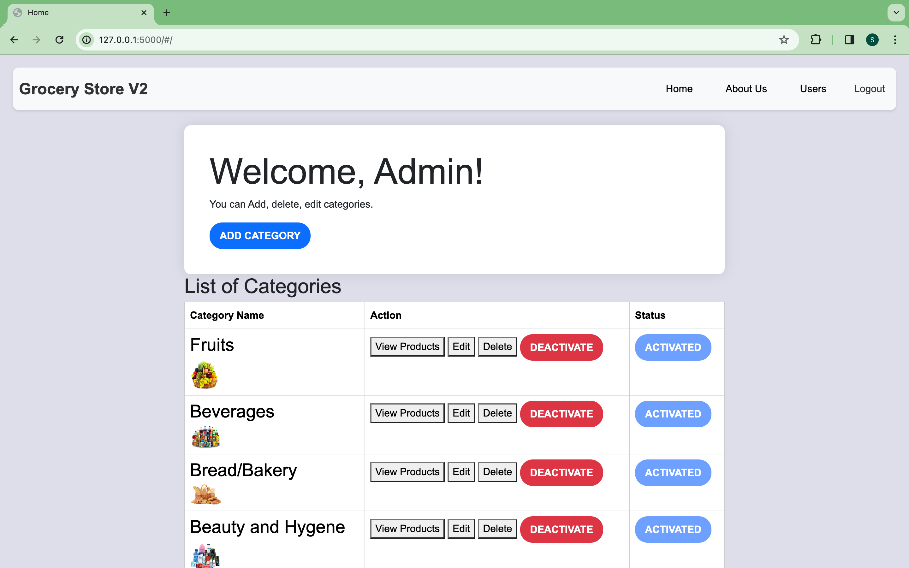
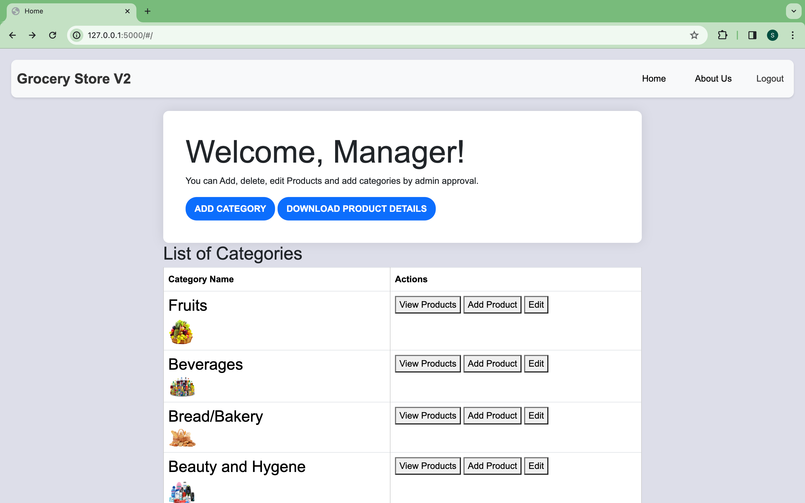
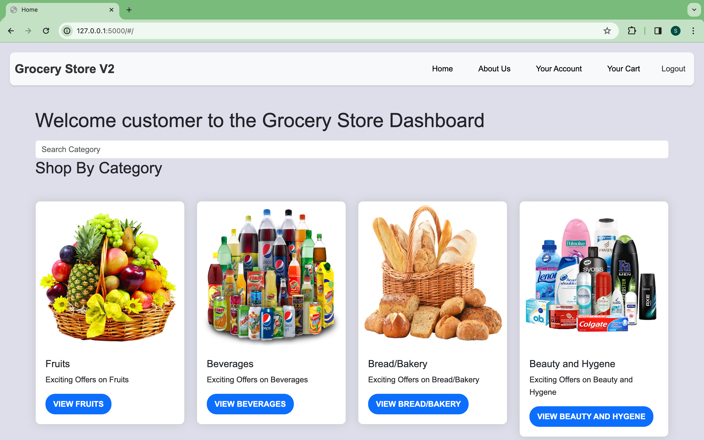
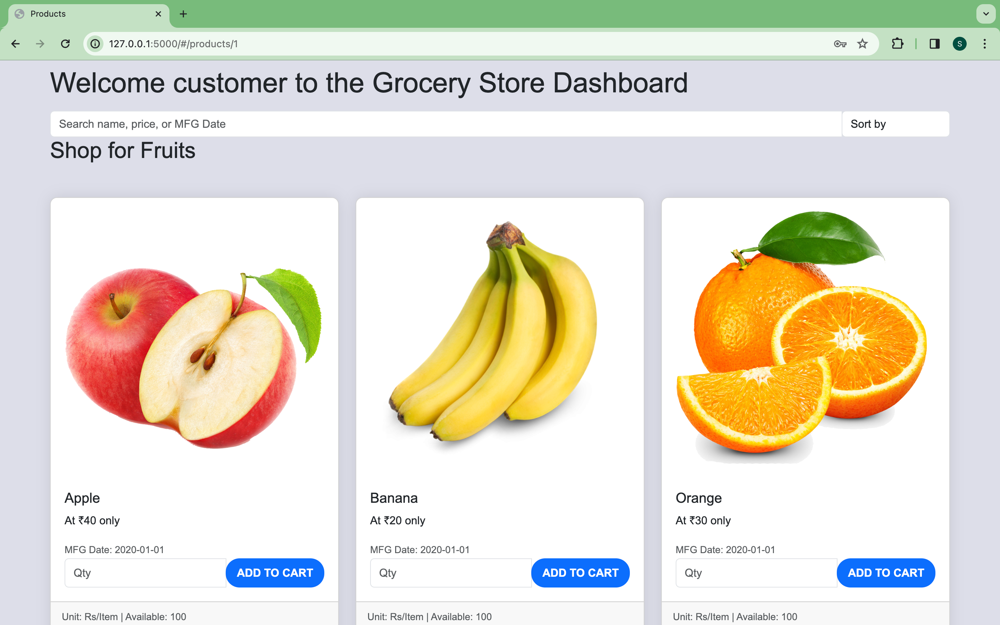

# Grocery Store Web Application

This project is a sophisticated multi-user grocery store web application that seamlessly integrates Vue.js for the frontend and Flask for the backend. Bootstrap ensures an intuitive, user-friendly interface, allowing for dynamic category and product management.

Browse to the [Satya Grocery Store Web Application](http://satya-grocery-store.ap-south-1.elasticbeanstalk.com/) to view the deployed application.

- [Grocery Store Web Application](#grocery-store-web-application)
  - [Installation](#installation)
  - [Usage](#usage)
  - [Background Job Execution](#background-job-execution)
  - [Screenshots](#screenshots)
  - [Description](#description)
  - [Architecture and Features](#architecture-and-features)

## Installation

1. Create a virtual environment:
`python3 -m venv venv`

2. Activate the virtual environment:
`source venv/bin/activate`

3. Install required dependencies:
`pip install -r requirements.txt`

4. Set up Environment Variables:
`export DATABASE_URL=sqlite:///database.sqlite3`

5. Create a SQLite3 database by running:
`python upload_initial_data.py`

6. Start the Flask server:
`flask run`

7. Visit `localhost:5000` in your browser to access the grocery store application.

## Usage
Login as an admin to manage categories and approve manager requests. Login as a manager to manage products within approved categories. Login as a customer to shop and place orders.
- **Admin Credentials**:
    - **Email**: admin@gmail.com
    - **Password**: admin
- **Manager Credentials**:
    - **Email**: manager@gmail.com
    - **Password**: manager
- **Customer Credentials**:
    - **Email**: customer@gmail.com
    - **Password**: customer

- you cam also create your own account and login.
- you can register as a manager and wait for admin approval.
- you can register as a customer and start shopping.

## Background Job Execution

This application uses Redis and Celery to execute background jobs. To run the application with background job execution, follow these steps:

To test the email notification features such as daily reminder emails and monthly reports, navigate to the `app.py` file and check the `send_email` and `send_report` functions and update the time to your desired time. Then, restart the app 

then run the following commands:

- open a new terminal and run the following command:
    - `redis-server`
- open a another terminal and run the following command:
    - `celery -A app.celery worker --loglevel=info`
- open one terminal and run the following commands:
    - `celery -A app:celery_app beat -l INFO`

This will start the celery worker and celery beat.

To test emails in development, you can use Mail-Hog. To install Mail-Hog, Browse to the [Mail-Hog GitHub Repository](https://github.com/mailhog/MailHog) and follow the installation instructions for your operating system. Once installed, run Mail-Hog and visit `localhost:8025` in your browser to view emails sent by the application.

## Screenshots

- **Admin Home Page**:

- **Manager Home Page**:

- **Customer Home Page**:

## Description

This application is designed to provide a comprehensive and seamless grocery shopping experience. It merges frontend and backend technologies to ensure smooth interactions for users, admins, and managers.

- **Vue.js & Flask Integration**: Frontend and backend technologies merge seamlessly to offer a responsive and interactive user experience.

- **Dynamic Category and Product Management**: Admins and managers have effortless control over categories and products, enabling real-time stock updates and flexible pricing options.

- **Security Features**: Token-based authentication ensures secure access for admins, managers, and customers. Admins have control over manager approvals, establishing a secure access hierarchy.

- **Flask REST APIs**: Strict data validation through APIs ensures accuracy and integrity of user interactions.

- **Efficient Batch Job Execution**: Integration of Redis and Celery enhances performance during heavy loads, ensuring efficient batch job execution.

## Architecture and Features

The project's architecture consists of several key components:

- **Model Definitions**: `model.py` contains definitions for different models like Category, Product, Association, User, Role, RoleUsers, Cart, and Bought.

- **Controllers and API Endpoints**: `app.py` manages app creation and controllers, while `api.py` houses all API endpoints.

- **Token-based Authentication**: Implementation of token-based authentication for Admin, Customer, and Manager roles.

- **Role-based Access Control**: Admins can perform CRUD operations on categories, managers can manage items within approved categories, and customers can shop and place orders.

- **Email Notifications**: Admins can send daily reminder emails to customers and monthly reports to managers.

This application offers a robust, secure, and responsive grocery shopping experience, ensuring data integrity while seamlessly integrating functionalities for various user roles.

